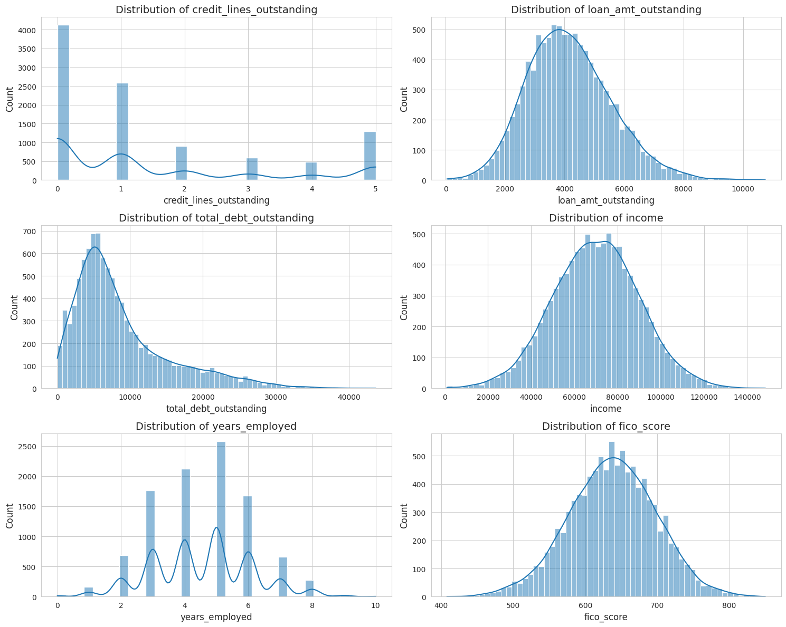
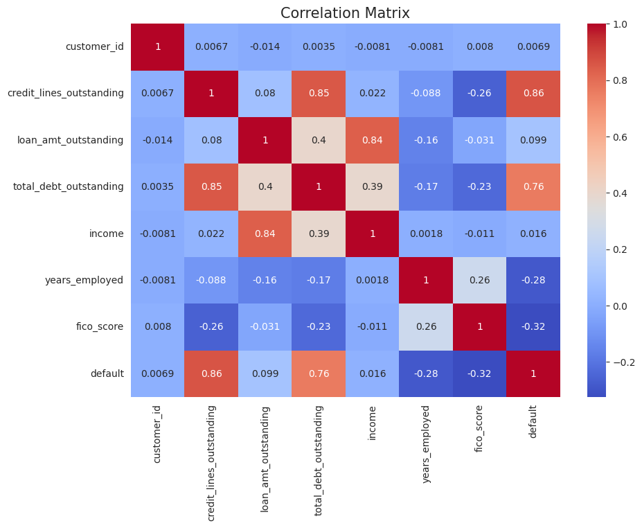
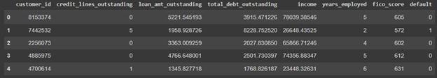
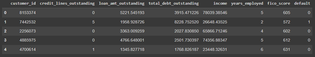
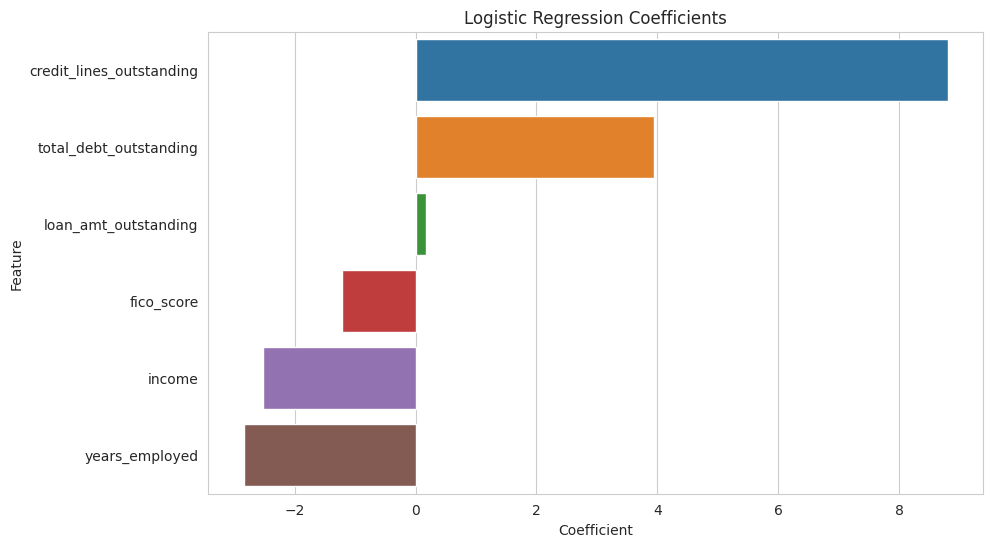
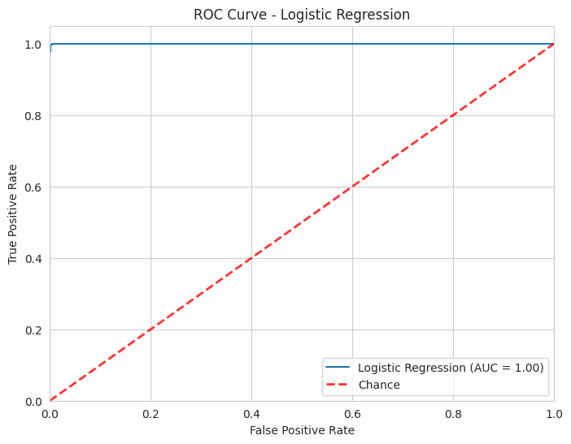
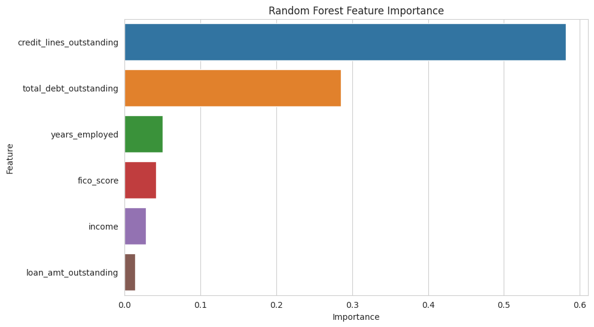
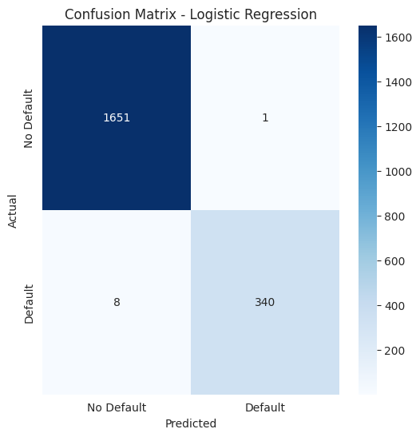
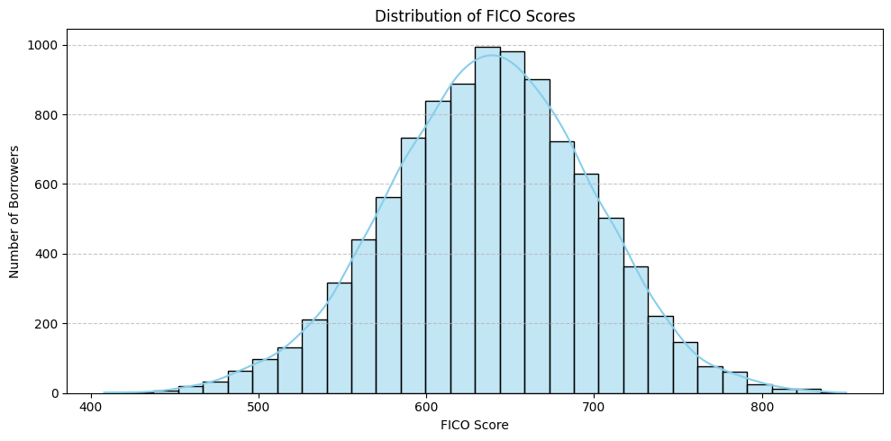
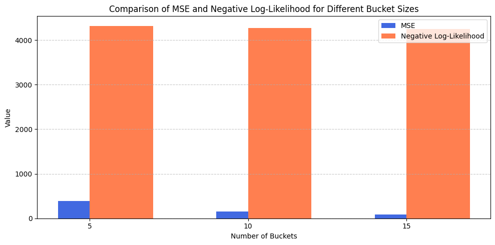

# Advanced Credit Risk Analysis: FICO Score Quantization & Predictive Modeling

In the financial domain, understanding credit risk is paramount for various functions, including quantitative trading and research. This project dives deep into the mathematical and analytical techniques to dissect credit risk using FICO scores and various quantization methodologies.

## Introduction

FICO scores, established by the Fair Isaac Corporation, are the cornerstone of credit evaluations in the U.S. By analyzing patterns in these scores and their corresponding default rates, we can extrapolate significant insights, beneficial for quant-driven strategies in trading, asset management, and risk hedging.

## Dataset Overview

**Loan Dataset** provides a granular view of individual borrowers, capturing:
- Credit Lines Outstanding
- Loan Amount Outstanding
- Total Debts
- Income Levels
- Years Employed
- FICO Scores
- Default Status

**Mortgage Dataset** delves into mortgage specifics, concentrating on FICO scores and default statuses.

## Analytical Approach & Highlights

### 1. Exploratory Data Analysis

A rigorous analysis was conducted to understand data distributions, correlations, and outliers.

*Insights into the statistical distribution of various features in the dataset.*

 

*In-depth feature distributions of the loan dataset highlighting patterns and trends.*

*Snapshot of the mortgage dataset, showcasing the granularity of available data.*

### 2. Predictive Modeling on Loan Data

Employing state-of-the-art machine learning models, we predicted the likelihood of loan defaults:

- **Logistic Regression**: 
  - Coefficients' Insight
  
  
  
  - ROC Curve Analysis
  
  

- **Random Forest Classifier**: 
  - Feature Importance Visualization
  
  
  
  - Confusion Matrix
  
  

### 3. Quantitative Analysis on Mortgage Data

The main challenge was transforming continuous FICO scores into categorical buckets for enhanced modeling and insights.

- **MSE-Based Quantization**: A mathematical approach aimed at minimizing the mean squared error.
- **Log-Likelihood Based Quantization**: By maximizing a specific log-likelihood function.

*Distribution of FICO scores in the dataset.*

*A quantitative comparison of MSE and Negative Log-Likelihood across different bucket sizes.*

## Relevance to Quantitative Trading & Research

Credit risk insights play a pivotal role in:
- **Portfolio Optimization**: Determining the risk-adjusted returns.
- **Quantitative Strategies**: Especially in fixed-income trading, where credit risk impacts bond pricing.
- **Asset Allocation**: Diversifying across assets with varied credit profiles.
- **Hedging Strategies**: Using credit derivatives or other financial instruments.

## Conclusion

By blending advanced mathematical techniques with machine learning, this project offers a deep dive into credit risk. Such insights are invaluable for anyone in the quantitative domain, from traders to researchers, seeking to harness the power of data-driven decision-making.

